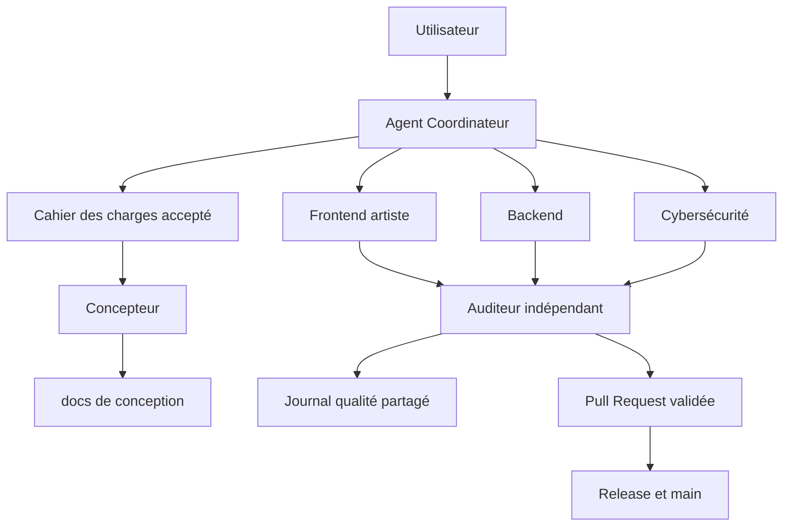

# Agentic Starter Kits

## Construire avec une IA comme avec une équipe senior

Agentic Starter Kits est une base portable de gouvernance, de conception, d’orchestration et de contrôle qualité pour construire des projets logiciels avec un agent IA. Le dépôt transforme une conversation en processus de livraison traçable, depuis le cahier des charges jusqu’à la Pull Request et à la maintenance.

Le kit ne fournit pas une simple collection de prompts. Il fournit une méthode de travail complète : règles, agents spécialisés, Skills réutilisables, configuration technologique, documents de conception, journal qualité, contrôles de sécurité, GitFlow, CI et optimisation continue du coût.

## Ce que le projet permet de faire

Avec un seul kit importé dans un nouveau dépôt, l’IA peut :

- Refuser de commencer tant qu’un cahier des charges réel n’est pas fourni et accepté.
- Analyser la machine, le dépôt existant, la stack et les commandes disponibles.
- Adapter son comportement aux technologies déclarées dans `project-profile.toml`.
- Produire une conception complète de niveau Concepteur Développeur d’Applications.
- Générer vision, objectifs, user stories, parcours, architecture, données, API, sécurité, roadmap et diagrammes.
- Proposer un Trello complet des tâches, après une réponse explicite de l’utilisateur.
- Répartir le travail entre six rôles spécialisés.
- Construire des interfaces premium avec direction artistique, design system, motion design et validation visuelle.
- Rechercher ou générer des médias réalistes avec provenance, licence et retouches documentées.
- Développer le frontend, le backend, les tests et la documentation par petits changements.
- Enregistrer bugs, vulnérabilités, défauts visuels et corrections dans un journal partagé.
- Auditer indépendamment chaque livraison avant sa clôture.
- Bloquer un push si les contrôles, tests, audits ou documents requis échouent.
- Livrer avec des branches, commits atomiques, Pull Requests et versionnement SemVer.
- Mesurer et améliorer progressivement la qualité, la performance et le coût d’utilisation des agents.

## Architecture générale

## Les deux kits disponibles

| Kit | Fichier racine | Dossier | Orchestrateur | Usage |
| --- | --- | --- | --- | --- |
| Codex | `AGENTS.md` | `.codex/` | Codex | Kit natif pour une orchestration avec Codex |
| Claude Code | `CLAUDE.md` | `.claude/` | Claude Code | Kit natif avec agents et Skills Claude |

Choisir un seul kit par projet. Les deux kits sont fonctionnellement alignés, mais leurs formats suivent leur outil respectif.

## Les six agents

### Coordinateur

Il est le chef d’orchestre. Il contrôle le périmètre, les dépendances, le découpage, les priorités, les budgets de raisonnement, les preuves attendues et la clôture. Il ne remplace pas les spécialistes et ne peut pas transformer une hypothèse en fait vérifié.

### Concepteur

Il transforme le besoin accepté en dossier exploitable. Il produit et maintient les user stories, critères d’acceptation, parcours, architecture, modèle de données, contrats, sécurité, roadmap, décisions et diagrammes éditables.

### Frontend, artiste digital

Il ne se limite pas à assembler des composants. Il définit une direction artistique singulière, un design system, une hiérarchie visuelle, des états complets, des micro-interactions et des animations utiles. Il vérifie le rendu sur plusieurs viewports, l’accessibilité, la performance et `prefers-reduced-motion`. Il documente la provenance et la licence de chaque média.

### Backend

Il construit les contrats, la logique métier, les API, les données, les migrations, l’observabilité, les erreurs et les tests. Il respecte le principe du changement minimal et escalade tout changement de contrat ou de donnée sensible.

### Cybersécurité

Il analyse les actifs, menaces, permissions, entrées, secrets, dépendances, sessions, données sensibles et contrôles réseau. Il qualifie les risques, conserve les preuves et peut bloquer une livraison critique.

### Auditeur

Il ne corrige pas ce qu’il vient d’approuver. Il vérifie les critères, le diff, les tests, la conception, la sécurité, le rendu visuel, les licences médias et les risques résiduels. Sa décision est `accepted`, `rework` ou `blocked`.

## Ce qui est généré dans chaque projet

Après le cahier accepté, l’initialisation crée un dossier `docs/` structuré :

- `product/` pour la vision, le périmètre, les stories et les parcours.
- `design/` pour l’architecture, les données, les contrats, la sécurité, la direction artistique et l’inventaire médias.
- `diagrams/` pour les sources Mermaid ou éditables.
- `delivery/` pour la roadmap et les décisions.
- `quality/quality-journal.md` pour les anomalies et vérifications.
- `project-management/trello-board.md` si l’utilisateur choisit Trello.

Les marqueurs `[[A_COMPLETER]]` bloquent le preflight. Le projet ne peut donc pas passer directement d’un modèle vide à l’implémentation.

## Les garanties de gouvernance

Le kit impose :

- Cahier des charges obligatoire.
- Profil de technologies explicite.
- Conception maintenue pendant toute la durée du projet.
- Journal unique pour bugs, failles, défauts visuels et corrections.
- Vérification indépendante avant clôture.
- GitFlow avec une branche par feature, correctif ou documentation.
- Commits atomiques et taille limitée.
- Lint, tests, sécurité et vérification avant push.
- CI GitHub pour les imports Codex, Claude et PowerShell.
- Distinction claire entre vérifié, non vérifié, inconnu et risque résiduel.

## Installation et premier démarrage

Le guide complet et unique est [INSTALLATION.md](INSTALLATION.md). Il explique les prérequis, la copie du kit, l’initialisation, la conversation obligatoire, le choix Trello, la configuration des technologies, la conception, le premier work item, les tests, le GitFlow et la première livraison.

Guides rapides :

- [Kit Codex](starter-kit-codex/README.md)
- [Kit Claude Code](starter-kit-claude/README.md)

## Fonctionnement quotidien

1. Ouvrir l’agent à la racine du projet.
2. Fournir le cahier des charges dans le chat.
3. Répondre au choix Trello.
4. Valider le profil de technologies détecté.
5. Compléter la conception générée.
6. Demander un work item précis.
7. Laisser le Coordinateur distribuer le travail.
8. Vérifier les tests, lint, sécurité et documentation.
9. Faire auditer la livraison.
10. Commiter sur la branche dédiée et ouvrir la Pull Request.

Pour une conversation sans construction de projet, utiliser explicitement `Mode général`. Pour maintenir le kit, utiliser `Mode maintenance`.

## Performance et coût

Le Coordinateur choisit un niveau de raisonnement proportionné au risque. Les tâches répétitives, contrôlables ou documentaires utilisent le profil le plus économique compatible. Les décisions d’architecture, de sécurité et d’audit utilisent un raisonnement plus approfondi. Les évaluations enregistrent les résultats, les relances, les défauts détectés, le temps et le coût afin d’améliorer les règles sans dégrader la qualité.

Le fichier `.codex/metrics/usage.jsonl` ou `.claude/metrics/usage.jsonl` conserve la télémétrie interne des délégations. Elle aide le Coordinateur à réduire le contexte, éviter les relances, regrouper les tâches et sélectionner le modèle cohérent avec le risque. Utiliser `bash .codex/scripts/cost-tracker.sh report` ou son équivalent Claude pour consulter un résumé. Les tarifs sont facultatifs et ne sont jamais inventés.

## Mode autonome jusqu’à la livraison

Après réception et acceptation du cahier des charges, une instruction comme « fais tout » autorise le Coordinateur à exécuter la chaîne complète du work item : conception, implémentation, tests, audits, corrections, documentation, commit et Pull Request. Il ne demande pas « Continue » pour une étape déjà couverte par cette autorisation. Il s’arrête uniquement pour une décision irréversible, un secret, une autorisation externe ou un choix métier impossible à déduire.

## Limites importantes

Le kit ne devine pas les décisions métier, ne crée pas de secret, ne simule pas une preuve, ne garantit pas à lui seul la sécurité de production et ne peut pas confirmer une licence sans source vérifiable. Une image générée ou trouvée sur internet doit rester traçable et compatible avec son usage. Les validations critiques et les choix irréversibles peuvent nécessiter une décision humaine.

## Documentation du dépôt

- [Installation complète](INSTALLATION.md)
- [Contribution et GitFlow](CONTRIBUTING.md)
- [Sécurité](SECURITY.md)
- [Versionnement](VERSIONING.md)
- [Historique des changements](CHANGELOG.md)

## Dépannage rapide

- `Preflight` échoue : lire la première erreur, compléter le profil ou le cahier, puis relancer le contrôle.
- Trello n’est pas disponible : le plan local reste créé ; activer l’intégration puis demander une synchronisation vérifiée.
- Un outil manque sur la machine : lancer `doctor.sh`. Le Coordinateur utilise les outils disponibles et documente la limite.
- Une commande projet est inconnue : renseigner les champs `[commands]` du profil au lieu d’inventer une validation.
